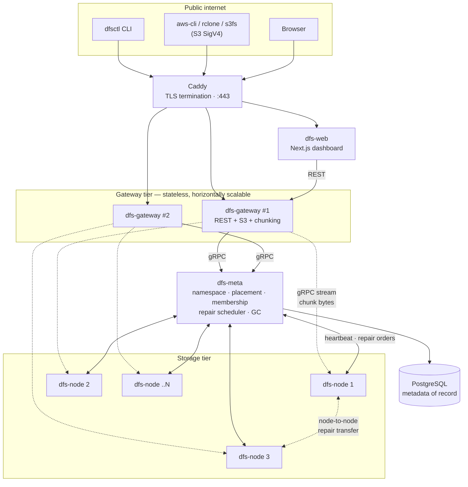
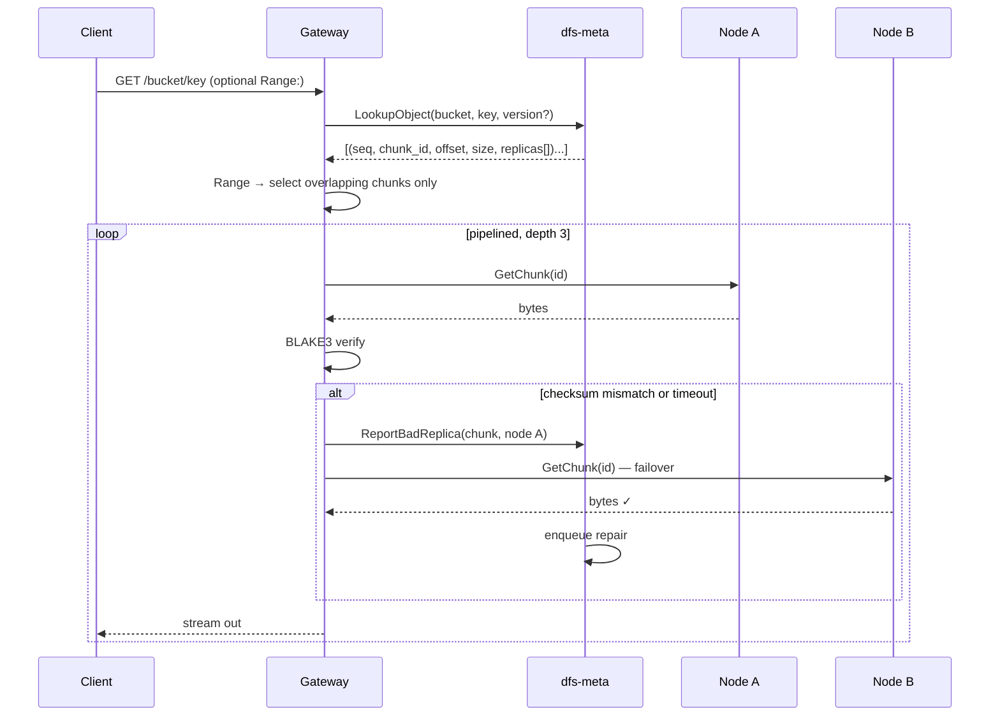
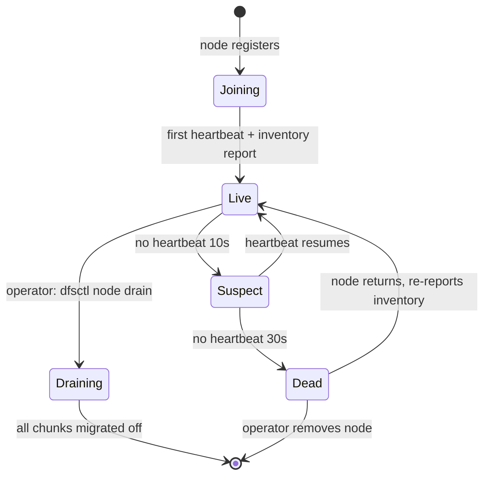

# DFS — System Architecture

A distributed file storage system: content-addressed, chunked, replicated, self-healing,
with an S3-compatible API. Written in Go, deployed as containers on a single VPS with a
multi-host path designed in from day one.

---

## 1. Design principles

These five decisions shape everything else. Read them first.

**1. Chunks are immutable and content-addressed.**
A chunk's ID *is* the BLAKE3 hash of its bytes. This is the single most important
simplification in the system: an immutable blob keyed by its own hash can never be stale,
never needs cache invalidation, never needs write coordination between replicas, and
de-duplicates for free. All the hard distributed-consistency problems get pushed into the
metadata layer, where a transactional database solves them cheaply.

**2. Objects are immutable and versioned.**
Overwriting `photos/cat.jpg` does not mutate anything — it writes a new version and flips
which version is `is_latest`, in one transaction. Readers never see a torn object. Deletes
are tombstones; space is reclaimed later by GC.

**3. Metadata is strongly consistent; data is eventually durable.**
Metadata lives in Postgres and is linearizable. A write is acknowledged once `W=2` of `R=3`
replicas have fsynced; the third replica is filled in asynchronously by the repair worker.
This gives read-after-write consistency with a bounded durability window.

**4. Storage nodes are dumb, the coordinator is smart.**
Nodes know how to store, serve, verify, and pull chunks. They know nothing about buckets,
objects, users, or where other chunks live. All placement intelligence is in the metadata
service. This keeps node code small enough to be obviously correct.

**5. Placement is computed, not stored.**
Rendezvous (HRW) hashing derives replica sets from the chunk ID and the live node list.
No ring configuration, no vnode tuning, and when a node leaves only that node's chunks move.

---

## 2. Component topology



### 2.1 `dfs-gateway` — the client-facing tier

Stateless. Any request can hit any instance. Responsibilities:

- Terminates **two** HTTP APIs on the same process: the native REST API (`/v1/...`, JWT auth)
  and the **S3-compatible API** (`/{bucket}/{key}`, AWS SigV4 auth). They share one storage
  engine underneath — only the wire format and auth differ.
- Runs the **chunking pipeline** on upload: streams the request body, splits it at chunk
  boundaries, hashes each chunk, negotiates placement with `dfs-meta`, and fans the bytes
  out to storage nodes in parallel.
- Runs the **assembly pipeline** on download: resolves the object to an ordered chunk list,
  pipelines fetches from nodes, verifies checksums, streams to the client, and transparently
  fails over to another replica if a node is slow or returns corrupt data.
- Issues and validates **presigned URLs**.

Because it is stateless, this is the only tier you scale for throughput.

### 2.2 `dfs-meta` — the coordinator

The brain. Single logical instance (see §8 for making it HA). Responsibilities:

| Subsystem | What it does |
|---|---|
| **Namespace** | Buckets, objects, versions, tombstones. All in Postgres transactions. |
| **Placement** | Given a chunk hash, returns the target replica set via weighted rendezvous hashing over live nodes. |
| **Membership** | Node registry + failure detector. Tracks `joining → live → suspect → dead → draining`. |
| **Repair scheduler** | Watches for under-replicated / corrupt chunks, enqueues repair jobs, dispatches them to nodes at a rate limit. |
| **Rebalancer** | On node join or capacity skew, migrates chunks toward the placement the hash function would choose today. |
| **GC** | Walks chunk refcounts, deletes orphans after a grace period. |

### 2.3 `dfs-node` — the storage node

Deliberately small. Speaks one gRPC service:

```
PutChunk(stream ChunkData)  → PutChunkAck      // streaming write, fsync, verify, atomic rename
GetChunk(ChunkRef)          → stream ChunkData // streaming read, checksum on the way out
StatChunk(ChunkRef)         → ChunkInfo
DeleteChunk(ChunkRef)       → Empty
PullChunk(PullRequest)      → PullAck          // repair: fetch this chunk from that peer
Heartbeat(stream NodeStatus)→ stream NodeCommand // bidirectional: status up, orders down
```

**On-disk layout** — two-level hex fanout keeps directory sizes sane:

```
/data/chunks/a3/f9/a3f9c2e1...blake3hex.chunk   # the bytes
/data/index.db                                   # BoltDB: id → {size, checksum, created, last_scrubbed}
/data/tmp/                                       # in-flight writes, cleaned on boot
```

**Write is crash-safe by construction:** write to `tmp/`, fsync the file, fsync the parent
dir, verify the hash matches the claimed ID, then `rename(2)` into place. A rename on the
same filesystem is atomic — a chunk file either exists complete and correct, or does not
exist. There is no third state, so crash recovery is just "delete `tmp/`".

**Scrubber:** a background goroutine continuously re-reads chunks at a low rate (e.g. full
sweep every 7 days), re-hashes them, and reports mismatches to `dfs-meta` as corruption.
This is how you catch bitrot before it silently eats a replica.

### 2.4 `dfs-web` — the dashboard

Next.js. File browser with drag-and-drop upload and progress, share-link generation, plus a
cluster view: node topology, per-node capacity and health, replication status, repair queue
depth, throughput graphs. It talks only to the gateway's REST API — no privileged backdoor.

### 2.5 `dfsctl` — the CLI

Single Go binary. `dfsctl cp`, `ls`, `rm`, `sync`, `cluster status`, `node drain`. Ships as a
static binary so it doubles as the ops tool on the VPS.

---

## 3. The write path

```mermaid
sequenceDiagram
    participant C as Client
    participant G as Gateway
    participant M as dfs-meta
    participant N1 as Node A
    participant N2 as Node B
    participant N3 as Node C

    C->>G: PUT /bucket/key  (streaming body)
    G->>G: Authn (JWT or SigV4)
    M-->>G: bucket exists? quota ok?

    loop per 8 MiB chunk
        G->>G: buffer chunk, hash with BLAKE3
        G->>M: AllocateChunk(hash, size)
        alt chunk already exists (dedup hit)
            M-->>G: EXISTS — skip upload, refcount++
        else new chunk
            M->>M: rendezvous(hash, live_nodes) → [A, B, C]
            M-->>G: WRITE_TO [A, B, C]
            par fan-out
                G->>N1: PutChunk(stream)
                G->>N2: PutChunk(stream)
                G->>N3: PutChunk(stream)
            end
            N1-->>G: ack (fsynced)
            N2-->>G: ack (fsynced)
            Note over G: W=2 satisfied → proceed.<br/>C's ack arrives late or never;<br/>repair worker reconciles.
        end
    end

    G->>M: CommitObject(bucket, key, [chunk refs], size, etag)
    M->>M: BEGIN; insert object+version; insert object_chunks;<br/>upsert placements; flip is_latest; COMMIT
    M-->>G: version_id
    G-->>C: 200 OK  (ETag, x-dfs-version-id)
```

**Why `W=2` and not `W=3`:** waiting for all three replicas means your p99 latency is the
p99 of your *slowest* node, and one sick node stalls every write in the cluster. Acking at 2
fsynced copies survives a single node loss immediately, and the repair worker restores `R=3`
within seconds. This is the standard quorum trade and it is the right one here.

**Chunk size — 8 MiB fixed, initially.** Fixed-size chunking is simple and fast. It gives you
whole-file dedup and identical-prefix dedup, but not shift-resistant dedup (insert one byte
at the front of a file and every chunk boundary moves). Content-defined chunking via FastCDC
fixes that and is a Phase 9 upgrade — the chunk table doesn't change, only the splitter does.

**ETag compatibility:** S3 clients assert on ETag format. For single-part uploads emit the
MD5 hex of the object; for multipart emit `md5(concat(md5(part_i)))-N`. Compute MD5 alongside
BLAKE3 during upload — MD5 is used *only* as an S3 compatibility token, never for integrity.

---

## 4. The read path



Replica selection is by rendezvous score with a load tiebreak, so reads for the same chunk
naturally spread. Chunk fetches are pipelined (fetch chunk *n+1* while streaming chunk *n*)
so throughput is not gated by round-trip latency. Range requests only touch the chunks that
actually overlap the requested byte range.

---

## 5. Placement: weighted rendezvous hashing

For chunk `c` and each live node `n`:

```go
// score(c, n) — highest R scores win the chunk
func score(chunkID []byte, node Node) float64 {
    h := xxhash.Sum64(append(chunkID, node.ID...))
    // Weighted rendezvous (Jansen): weight by free capacity so
    // bigger/emptier nodes attract proportionally more chunks.
    return float64(node.WeightBytes) / -math.Log(float64(h)/math.MaxUint64)
}
```

Pick the top `R` nodes. Properties that matter:

- **Stateless** — any component can compute placement from `(chunk_id, node_list)`. No ring to
  distribute or keep in sync.
- **Minimal disruption** — remove a node and only *its* chunks relocate. Add a node and it
  pulls its fair share from everyone. No cascading reshuffle.
- **Capacity-aware** — a node with 2× the free space gets ~2× the chunks.
- **Failure-domain-aware, later** — when you move to multiple physical hosts, add a
  `zone` field and enforce "no two replicas in the same zone" as a filter before scoring.

---

## 6. Failure detection and self-healing



Heartbeats are a **bidirectional gRPC stream**: the node pushes status (capacity, chunk
count, load, scrub progress) every 3 s, and `dfs-meta` pushes commands back down the same
stream (`pull this chunk from that peer`, `delete this chunk`, `begin draining`). One
long-lived connection, no polling, and stream death is itself an instant failure signal.

**Repair pipeline.** Four independent triggers feed one queue:

| Trigger | Detected by | Priority |
|---|---|---|
| Node declared dead | Failure detector | High — its chunks are now at R=2 or R=1 |
| Corrupt chunk found | Node scrubber, or a reader's checksum mismatch | Critical |
| Write quorum shortfall | Commit acked at W=2, third replica never landed | Normal |
| Placement drift | Rebalancer: current placement ≠ what HRW says today | Low |

A repair worker pops a job, picks a target node (rendezvous, excluding current holders),
and sends it a `PullChunk` order naming a healthy source. **The bytes flow node-to-node,
never through the gateway or the coordinator.** Repairs are rate-limited (a token bucket on
concurrent transfers and aggregate bandwidth) so a node failure can't saturate the box and
take down live traffic — a repair storm turning a recoverable incident into an outage is one
of the classic ways real storage clusters die.

---

## 7. Erasure coding (Phase 6)

Replication at `R=3` costs 3× raw space. Reed–Solomon `k=4, m=2` costs 1.5× and tolerates
**any 2** of 6 shards being lost — strictly better durability than R=3 at half the storage.

```
8 MiB chunk ──split──> 4 data shards (2 MiB each)
                       + 2 parity shards (2 MiB each)
                       = 6 shards, placed on 6 distinct nodes
                       = 12 MiB stored for 8 MiB of data  (1.5×)
```

The trade-off is read cost: a normal read fetches 4 shards from 4 nodes instead of 1 chunk
from 1 node, and a *degraded* read (a shard's node is down) additionally costs a
reconstruction. So use a **hybrid policy**, which is what production systems do:

- objects `< 1 MiB` → replication `R=3` (small objects, latency-sensitive, EC overhead not worth it)
- objects `≥ 1 MiB` → erasure coding `4+2`

`github.com/klauspost/reedsolomon` is SIMD-accelerated and encodes at multiple GB/s — this
will not be your bottleneck.

---

## 8. Consistency, durability, and the honest limits

**What the system guarantees:**

- *Read-after-write consistency.* Once `PUT` returns 200, every subsequent `GET` sees that
  version. Guaranteed by the metadata commit being a single Postgres transaction.
- *Atomic overwrites.* No reader ever observes a partially-written object.
- *End-to-end integrity.* Every chunk is verified against its hash on write, on read, and
  periodically at rest. Silent corruption is not possible, only detectable loss.
- *Durability against node loss.* Any single node can die at any moment with zero data loss
  and zero downtime.

**What it does not guarantee, and you must not pretend otherwise:**

- **Postgres is a single point of failure.** If the metadata DB is lost, the chunks on disk
  are undecodable rubble — you'd have bytes with no idea which object they belong to or in
  what order. *The metadata backup is more important than the data backup.* Streaming
  replication + WAL archiving to off-box storage is not optional; it's Phase 8, non-negotiable.
- **On one VPS, replication does not protect against disk failure.** Six containers sharing
  one NVMe drive means `R=3` protects you against a *process or container* dying, not against
  the underlying disk dying. That is a genuinely different and much weaker guarantee. Your
  real durability story on a single box is **off-site backup**, and the replication is there
  to make the system architecturally correct so it becomes real durability the moment you add
  a second host. State this plainly in your README; do not let a portfolio reviewer catch you
  overclaiming it.
- **No cross-object transactions.** Each object commits independently.

---

## 9. Data model

```sql
-- Identity
users(id, email UNIQUE, password_hash, created_at)
access_keys(access_key_id PK, secret_hash, user_id, created_at, last_used_at)  -- S3 SigV4

-- Namespace
buckets(id, name UNIQUE, owner_id, created_at, versioning_enabled, quota_bytes)

objects(
  id, bucket_id, key, version_id,
  size, content_type, etag, storage_class,   -- 'replicated' | 'ec_4_2'
  is_latest, deleted_at, created_at, metadata JSONB
)
  UNIQUE (bucket_id, key, version_id)
  INDEX  (bucket_id, key) WHERE is_latest AND deleted_at IS NULL  -- the hot lookup
  INDEX  (bucket_id, key text_pattern_ops)                        -- prefix listing

object_chunks(object_id, seq, chunk_id, byte_offset)  PK (object_id, seq)

-- Physical layer
chunks(id BYTEA PK /* blake3-256 */, size, refcount, ec_scheme, created_at)

chunk_placements(
  chunk_id, node_id, shard_index,        -- shard_index = -1 for whole replicas, 0..5 for EC
  state,                                 -- 'pending' | 'ok' | 'corrupt' | 'missing'
  last_verified_at
) PK (chunk_id, node_id, shard_index)

nodes(id, addr, zone, capacity_bytes, used_bytes, state, last_heartbeat_at, version)

-- Operations
repair_queue(id, chunk_id, reason, priority, attempts, next_attempt_at, created_at)
```

`chunks.refcount` is what makes dedup safe: it increments on every object that references the
chunk and decrements on delete. GC only removes chunks at `refcount = 0` that have been there
longer than a grace period (guarding against the race where an upload is mid-flight).

---

## 10. Capacity plan for your VPS

Hostinger KVM2: **2 vCPU · 8 GB RAM · 100 GB NVMe · ~8 TB bandwidth · Debian**.

**Disk budget:**

```
100 GB total
 -15 GB   Debian + Docker images + Postgres + WAL + logs + Prometheus TSDB + headroom
 = 85 GB  available to the storage tier
```

Run **6 storage nodes, hard-capped at 13 GB each = 78 GB raw**, leaving ~7 GB of slack so a
runaway upload can never fill the root filesystem and take Postgres down with it. Each node
enforces its own cap and refuses writes above it — do not rely on the disk being the limit.

| Scheme | Overhead | Usable object data | Tolerates |
|---|---|---|---|
| Replication R=3 | 3.0× | **~26 GB** | 2 node losses |
| Erasure coding 4+2 | 1.5× | **~52 GB** | 2 node losses |
| Hybrid (final) | ~1.6× | **~48 GB** | 2 node losses |

That capacity jump is exactly why Phase 6 is worth building, and it's a great thing to be
able to demonstrate with a before/after graph.

**Memory budget (8 GB):**

```
Postgres            1.5 GB   (shared_buffers 512M, effective_cache_size 2G)
6 × dfs-node        1.5 GB   (256 MB each — they stream, they don't buffer)
2 × dfs-gateway     1.0 GB   (512 MB each — chunk buffers dominate)
dfs-meta            512 MB
Prometheus          512 MB   (15d retention, 30s scrape)
Grafana + Loki      512 MB
dfs-web (Next.js)   256 MB
Caddy                64 MB
─────────────────────────
                   ~5.9 GB   → ~2 GB headroom. Comfortable.
```

Add a 2 GB swapfile with `vm.swappiness=10` — not to use it, but so a memory spike degrades
into slowness instead of the OOM killer reaping Postgres.

**CPU (2 vCPU) is your real constraint.** BLAKE3 runs ~1–3 GB/s per core and Reed–Solomon
encodes at multiple GB/s, so hashing and coding are cheap. What will actually bite you is
running 12+ containers with unbounded GC on two cores. Set explicit `GOMAXPROCS` and memory
limits per container, and set `cpus:` limits in Compose so a repair storm can't starve the
gateway. Expect to comfortably sustain **~100–200 MB/s** of upload throughput end-to-end,
which saturates most home connections anyway.

---

## 11. Technology choices

| Concern | Choice | Why |
|---|---|---|
| Language | **Go 1.24+** | Goroutine-per-stream fits chunk fan-out exactly; static binaries → ~15 MB images |
| Internal RPC | **gRPC** + `buf` | Bidirectional streaming for heartbeats, chunked streaming for bytes, typed contracts |
| External API | **net/http + chi** | Close to stdlib; no framework magic in the hot path |
| Hashing | **BLAKE3** (`zeebo/blake3`) | 5–10× faster than SHA-256, tree-structured so it parallelizes |
| Metadata DB | **PostgreSQL 16** + `pgx` + `sqlc` | Real transactions; `sqlc` generates type-safe Go from your SQL — no ORM |
| Migrations | **goose** | Plain SQL up/down, embeddable in the binary |
| Node index | **BoltDB** | Single-file embedded KV, no server, crash-safe. Node-local only |
| Erasure coding | `klauspost/reedsolomon` | SIMD-accelerated, battle-tested |
| Metrics | Prometheus + Grafana | Standard, cheap on RAM |
| Logs | `log/slog` → Loki | Structured JSON, correlated by request ID |
| Edge / TLS | **Caddy** | Automatic Let's Encrypt with three lines of config |
| Dashboard | Next.js + Tailwind + TanStack Query | Fast to build, good upload-progress ergonomics |
| Tests | `testify` + `testcontainers-go` | Real Postgres in integration tests, not a mock |
| Load / chaos | `k6`, `toxiproxy` | Prove the failure claims instead of asserting them |

---

## 12. Repository layout

```
DFS/
├── api/proto/                 # buf-managed protobuf — the internal contract
│   ├── metadata/v1/metadata.proto
│   └── storage/v1/storage.proto
├── cmd/
│   ├── dfs-gateway/           # REST + S3 + chunking pipeline
│   ├── dfs-meta/              # coordinator
│   ├── dfs-node/              # storage node
│   └── dfsctl/                # CLI
├── internal/
│   ├── auth/                  # JWT issuance + AWS SigV4 verification
│   ├── chunk/                 # splitter, BLAKE3, streaming reader/writer
│   ├── placement/             # weighted rendezvous hashing
│   ├── erasure/               # Reed-Solomon encode/decode/reconstruct
│   ├── meta/                  # sqlc output + repository layer
│   ├── blobstore/             # node-local disk store + BoltDB index + scrubber
│   ├── cluster/               # membership, failure detector, heartbeat stream
│   ├── repair/               # repair queue, workers, rebalancer, GC
│   ├── s3/                    # S3 XML types, handlers, multipart, presign
│   ├── restapi/               # native REST handlers
│   └── obs/                   # slog setup, prom metrics, request IDs
├── db/migrations/             # goose SQL
├── web/                       # Next.js dashboard
├── deploy/
│   ├── compose/               # docker-compose.{dev,prod}.yml
│   ├── caddy/Caddyfile
│   ├── grafana/dashboards/
│   └── scripts/               # bootstrap-vps.sh, backup.sh, restore-drill.sh
├── test/
│   ├── integration/
│   ├── chaos/                 # kill-node, corrupt-chunk, partition scenarios
│   └── load/                  # k6 scripts
└── Makefile
```

**Structure rule:** `internal/` holds all logic and is unit-testable without Docker; `cmd/`
holds only flag parsing, wiring, and graceful shutdown. If you find yourself writing an
`if` statement in `cmd/`, it belongs in `internal/`.
